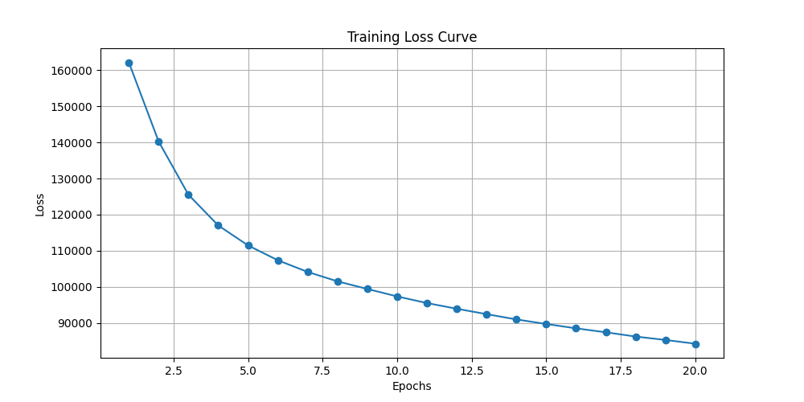
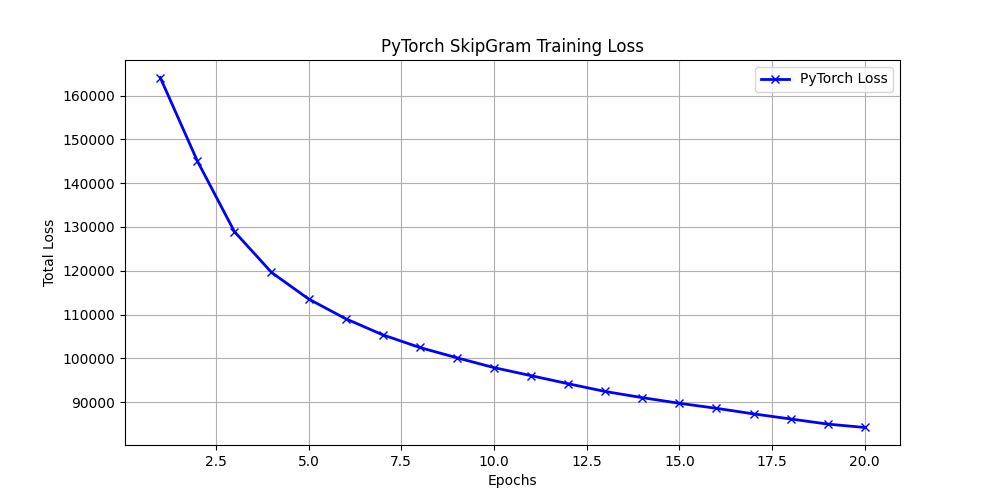

# Word2Vec – Skip-Gram with Negative Sampling

---

## 1. Overview

Word2Vec learns dense vector representations by exploiting distributional context. Two variants:

| | CBOW | Skip-Gram (this impl.) |
|---|---|---|
| **Task** | Context → Target | Target → Context |
| **Rare words** | Weak | Good |
| **Data needed** | Less | More |

*Note: At the end of this document, we will also include a brief comparison with a pure PyTorch implementation.*

---

## 2. Training Pipeline

### Step 1 – Load & Tokenize
Corpus is lowercased, stripped of punctuation (`,.:;!?`) and split on whitespace. Only the first 10,000 tokens are used.

```python
tokens = load_text('text8/text8')   # list[str], len=10000
```

### Step 2 – Vocabulary & Unigram Distribution
Each unique token gets an integer index. A smoothed unigram probability is built for negative sampling:

```
P(w) = freq(w)^0.75 / Σ freq(w')^0.75
```

The exponent **0.75** is a temperature-like parameter: it flattens the distribution, giving rare words a higher sampling probability than raw frequency would allow, without fully equalizing.

### Step 3 – Positive Pair Extraction
A sliding window of size `w=2` generates `(target, context)` pairs for every token and each neighbour within ±w positions (self excluded).

```
sentence:  the  cat  eats  fish   (window=1)
pairs:     (cat,the)  (cat,eats)  (eats,cat)  (eats,fish)  ...
```

### Step 4 – Embedding Initialization
Two matrices initialized with small random values (σ=0.01):

```
W_in   [V × D]   — encodes the target word
W_out  [V × D]   — encodes the context / negative words
```

---

## 3. Loss Function & Gradients

### 3.1 Negative Sampling Objective

For each positive pair `(t, c)` with `k` negative samples `{n₁,…,nₖ}`:

```
L = −log σ(vₜ · v_c)  −  Σᵢ log σ(−vₜ · v_nᵢ)
```

| Term | Goal | Gradient on vₜ |
|---|---|---|
| `−log σ(vₜ·v_c)` | Maximise dot product with real context → **PULL** together | `(σ(s) − 1) · v_c` |
| `−log σ(−vₜ·v_n)` | Minimise dot product with noise words → **PUSH** apart | `σ(s_n) · v_n` |

### 3.2 Why the Two Gradients Differ

Starting from the chain rule, with `s = vₜ · v_c`:

```
Positive:  ∂L/∂s =  −d/ds log σ(s)   =  −(1 − σ(s))  =  σ(s) − 1
Negative:  ∂L/∂s =  −d/ds log σ(−s)  =  −σ(−s)·(−1)  =  σ(s)
```

The sign difference is fundamental:
- **Positive pair**: gradient is `σ(s)−1 ≤ 0` → update pushes `vₜ` and `v_c` **closer** (dot product ↑)
- **Negative pair**: gradient is `σ(s) ≥ 0` → update pushes `vₜ` and `v_n` **apart** (dot product ↓)

`σ(s)−1` and `σ(s)` are numerically complementary: they sum to 1, each lying in `[0,1]`.

### 3.3 Parameter Update (one pair)

```python
grad_vt  = (σ(s_pos)−1)·v_c  +  Σᵢ σ(s_neg_i)·v_nᵢ
W_in[t]  -= lr · grad_vt
W_out[c] -= lr · (σ(s_pos)−1) · vₜ
W_out[n] -= lr · σ(s_neg)    · vₜ   # for each negative n
```

`W_in[t]` is updated **once per window** after accumulating gradients from all negative samples; context/negative vectors are updated immediately.

---

## 4. Training Loop

```python
for epoch in range(epochs):
    for (target, context) in positive_pairs:
        compute positive score  →  update W_out[context]
        sample k negatives      →  update W_out[neg_i]
        update W_in[target]          # once, with accumulated gradient
    lr *= 0.95
```

Hyperparameters: `epochs=20`, `neg_samples=5`, `lr=0.025`, `window=2`, `embedDim=100`.

---

## 5. Results – Training Loss

The model was trained for 20 epochs on the first 10,000 tokens of text8. Loss decreases consistently, confirming correct gradient flow.



*Figure 1 – Training loss over 20 epochs (text8, 10k tokens)*

The steep initial drop is expected: embeddings start from near-zero random values, giving large gradients early on. The curve flattens after epoch 10 as the model converges.

---

## 6. Hyperparameter Reference

| Parameter | Value | Notes |
|---|---|---|
| `embedDim` | 100 | Embedding vector size |
| `window_size` | 2 | ±2 context neighbours |
| `neg_samples` (k) | 5 | Negative words per pair (original paper: 2–20) |
| `lr` (initial) | 0.025 | Decays ×0.95 each epoch |
| `unigram_exp` | 0.75 | Smoothing exponent for negative sampling distribution |
| `epochs` | 20 | Full passes over all positive pairs |


---

---

## 7. Comparison: NumPy vs. PyTorch

To validate the mathematical correctness of our custom from-scratch implementation, a secondary project was created using PyTorch to perform the exact same task. 

As we can see from the pictures below, the loss curves are almost identical. This confirms that the manual gradients and negative sampling math used in the NumPy version are functioning exactly as intended.

<p align="center">
  
  
</p>